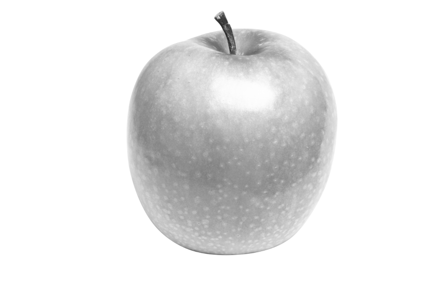
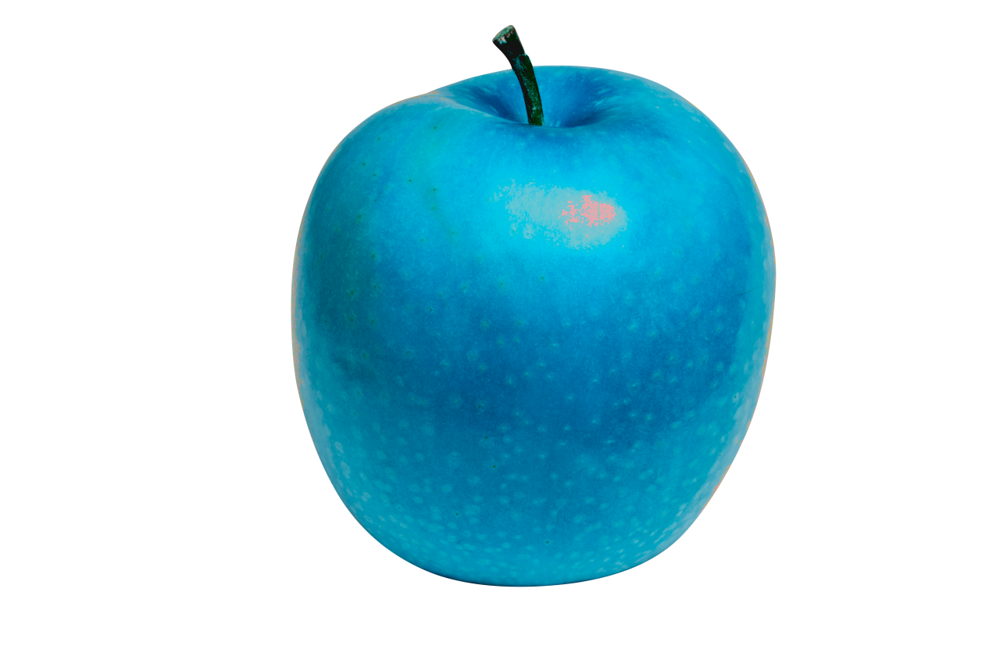
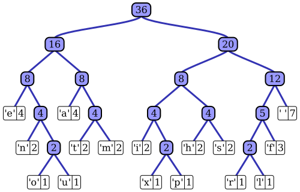
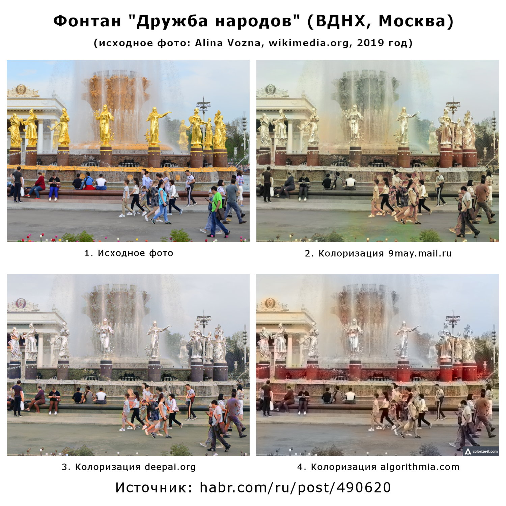
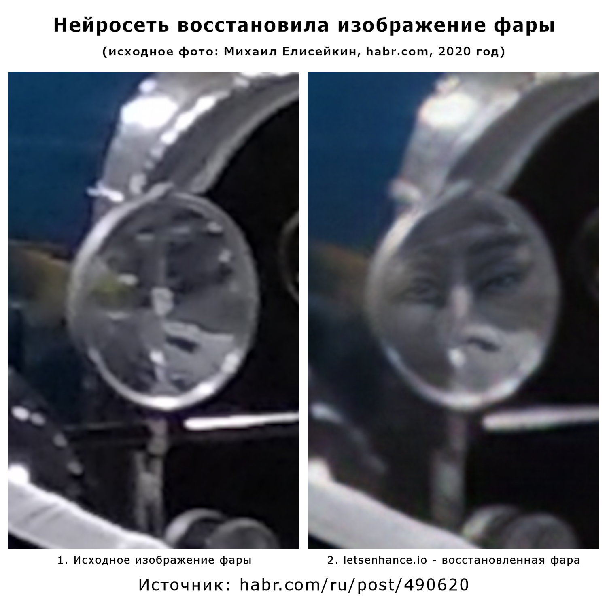
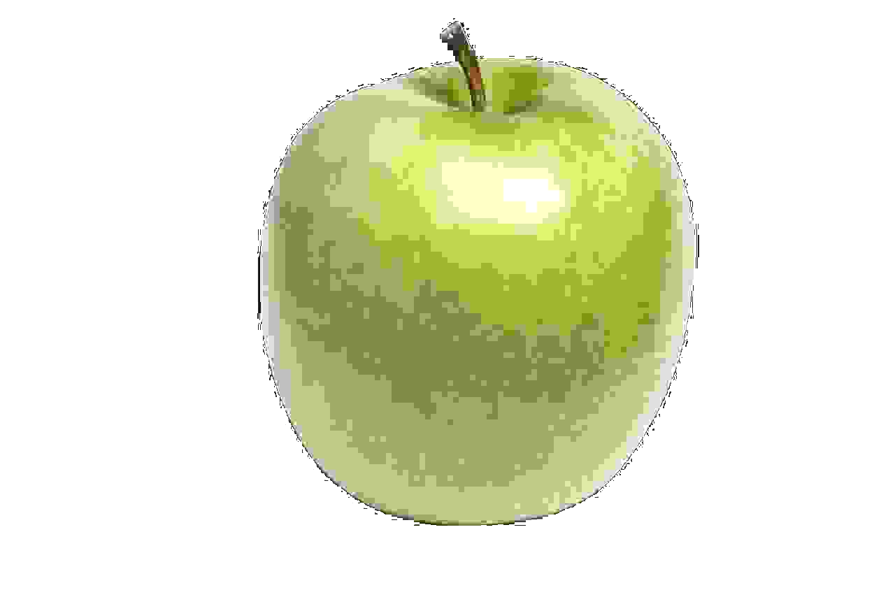

% Теория информации в байках и примерах
% Макс Силинг

## Количество информации

* Хорхе Луис Борхес в 1941 году описывает одну из основных концепций теории информации

* Вавилонская библиотека содержит все возможные книги, состоящие из 410 страниц; на каждой странице 40 строк, в каждой строке 80 знаков английского алфавита (+ пунктуация и пробелы)

* А сколько всего информации в библиотеке?

## Яблоко

\center { height=55% }

> * Вводная: яблоки бывают красными или зелёными
>
> * Это яблоко — красное
>
> * Это яблоко — зелёное

## Яблоко?

\center { height=55% }

## Список книг в Вавилонской библиотеке

(для упрощения будем игнорировать пробелы и пунктуацию)

* aaaa\dots{}aaaa

* aaaa\dots{}aaab

* \dots

* zzzz\dots{}zzzy
* zzzz\dots{}zzzz

## Бит

> * Мы хотим найти книгу в Вавилонской библиотеке
> 
> * «Эта книга начинается с какой-то буквы от a до m включительно»
>
> * Бит — количество информации, которое уменьшает неопределённость в два раза

## Игра

Нужно угадать слово из 5 русских букв кроме «ё»

> * 32 варианта на каждую букву
> 
> * Соответственно, неопределённость получается $32^5 = 33554432$ варианта
> 
> * Чтобы остался 1 вариант, нужно уменьшить $32^5$ в два раза 25 раз (иначе говоря, $log_2(32^5) = 25$)
>
> * Выходит, в худшем случае требуется 25 вопросов, чтобы угадать слово

## Пример и байка: плотность информации в тексте

> * Не все сочетания букв являются настоящими словами. Соответственно, в реальном тексте меньше информации, чем в «словах» из прошлой игры.
>
> * Берём текст и срезаем его в случайном месте. Потом просим испытуемого угадать следующую букву. В среднем испытуемый угадывает примерно в половине случаев.
>
> * Следовательно, плотность информации (английского) текста — примерно 1 бит на букву.
>
> * Вывод: английский текст можно сжать примерно в восемь раз.

## Плотность информации в тексте: другой пример

\huge Елси бы в бквуе сржсеалодоь 5 бит иамницифро, этот тксет был бы пьостонлю ничыетаемм

## Код Хаффмана

\center { height=75% }

## Пример и байка: сжать Википедию

> * Задача: написать программу, которая получает на вход полный текст Википедии и порождает файл минимального размера, который потом сможет превратить обратно в полный текст Википедии.
>
> * Идеальное решение в этой формулировке: «сжимаем» в пустой файл, «разжимаем» любой файл в полный текст Википедии.
>
> * Устраняем уязвимость: включаем размер разжимающей программы в размер сжатого файла.

## Пример и байка: архиватор Бабушкина

1. Представляем файл как двоичное число

2. Переводим двоичное число в десятичное, дописываем в начало «0.»

3. Получаем очень длинную десятичную дробь: 0.123456...

4. Представляем её как числитель и знаменатель и сокращаем

5. Полученные два числа и есть результат сжатия

## Пример: кодировки

Текст на каком из трёх языков будет весить больше?

* Английская буква в кодировке UTF-8 занимает 1 байт

* \alert<2>{Русская буква — 2 байта}

* Китайский иероглиф — 3 или 4 байта

## Пример: защита от повреждения

* Если записать информацию два раза подряд — будет больше шансов её восстановить в случае чего

* Есть более эффективные способы (например, коды Рида — Соломона), но все они основываются на некотором дублировании информации

* В некотором роде, защита от повреждения противоположна сжатию

## Ключевые свойства информации

* Информация не может взяться из ниоткуда

* Информация _может_ пропасть в никуда

* Если информация пропала в никуда, то её больше нельзя восстановить, потому что это противоречило бы первому пункту

* Количество информации не зависит от представления: сжатый английский текст может быть компактнее на компьютере, но количество информации в нём лишь немного меньше

## Пример и байка: «восстановление» картинок нейросетями {.standout}

\huge Что с этим не так?

## Восстановленная фотография

\center { height=80% }

## Восстановленная фотография

\center { height=80% }

## Восстановленная фотография

\center { height=80% }

## Пример: more JPEG!

\center { height=75% }

## Запрет на копирование

\huge Если информацию можно получить, её можно скопировать\*

\normalsize \*не является юридическим советом

## Итого

* Информации может стать меньше, но не больше
  
  * (а информация, которую создают люди в некотором роде заложена в мире — но это уже вопрос детерминизма)

* Соответственно, однажды потерянную информацию восстановить нельзя

* Получение информации это копирование

* Сжатие без потерь не уменьшает количество информации, а записывает ту же информацию короче (и перемещает часть информации в разжимающую программу)

## Конец? {.standout}

\LARGE Вот тут можно задавать вопросы

## Бонус: пища для паранойи

> * Сколько примерно информации нужно, чтобы уникально идентифицировать человека?
>
> * В мире примерно 8 миллиардов людей
>
> * $log_2(8*10^9) \approx 33$ бита
>
> * Чтобы сайту, на который вы зашли, идентифицировать вас, ему достаточно собрать всего ~4 байта информации

## Бонус: игра в покер по телефону

Задача: раздать Алисе и Бобу по шесть карт из колоды так, чтобы каждый знал только свои карты. И Алиса, и Боб могут жульничать, а связь по телефону ненадёжна.

## Бонус: игра в покер по телефону (решение)

> * Существуют алгоритмы шифрования, которые можно применять в любом порядке: $E_{P1}(E_{P2}(M)) = E_{P2}(E_{P1}(M))$

> * Алиса шифрует все карты своим ключом. Боб сдаёт ей 6 карт. Алиса может их расшифровать, потому что сама их зашифровала

> * Боб шифрует все оставшиеся карты своим ключом и отдаёт их Алисе. Алиса не может их расшифровать, потому что они зашифрованы двумя ключам

> * Алиса расшифровывает шесть карт и сдаёт их Бобу. Теперь они зашифрованы только ключом Боба и Боб может их расшифровать
